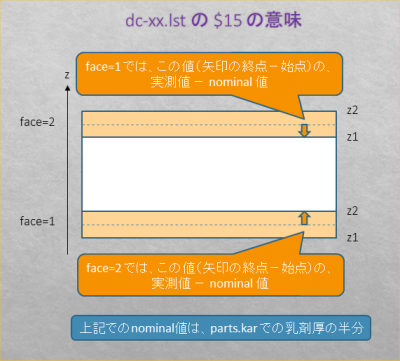

---
#### correction-map-absolute
---

  > used for distortion-shrink correction and absolute correction among plates  

  ```
  column  description
  01      id      area id
  02-03   pos,pos same pos appears twice to have the same format as of the relative correction map
  04-07   xmin,xmax,ymin,ymax
  08-13   a,b,c,d,p,q affine parameter for position
  14-19   a,b,c,d,p,q affine parameter for angle. ( for distorion-shirnk correction see (i) below )
  20      dz      dz ( for distortion-shrink correction see (ii) below )
  21-23   signal,background,S/N
  24-25   rms_x,rms_y
  26-27   not used
  28-29   rms_ax,rms_ay
  30      not used
  31-32   ix,iy   two dimensional index of the view
  33-38   flags-int    ca ( compton align ) uses these fileds  
  39-41   flags-double dc uses these fields as below ( implemented from r1162 ) 
            v[0] : shrink-peak-flat-top-width  
            v[1] : distortion-x-peak-flat-top-width  
            v[2] : distortion-y-peak-flat-top-width  
  ```

> (i) For distortion-shrink correction map file ( dc-xx.lst ), these parameters have special meaning and are used as below.  
>> x-corrected -= dz_fulcrum &times; p  
>> y-corrected -= dz_fulcrum &times; q  
>> z-corrected += dz  
>> ax-corrected = a &times; ax-raw + p  
>> ay-corrected = a &times; ay-raw + q  
>> where dz_fulcrum = nominal_fulcrum_z - z_nominal + b, 
>> i.e corrected distance between z-fulcrum and z-micro-track. 
>>  
>> 

> (ii) This value is "measured-base-thickness - nominal-base-thickness" for face-2 and 0 for face-1  

---
#### correction-map-relative
---  

  > used for reltive correction between two plates  
  > affine parameters are to be applied to values on pos1 to be comparable with those on pos0.  

  ```
  column  description
  01      id      area id
  02-03   pos0,pos1   pos0( base pos ),pos1   
  04-07   xmin,xmax,ymin,ymax
  08-13   a,b,c,d,p,q affine parameter for position
  14-19   a,b,c,d,p,q affine parameter for angle. ( for distorion-shirnk correction see (i) below )
  20      dz      dz ( for distortion-shrink correction see (ii) below )
  21-23   signal,background,S/N
  24-25   rms_x,rms_y
  26-27   not used
  28-29   rms_ax,rms_ay
  30      not used
  31-32   ix,iy   two dimensional index of the view
  33-38   flags-int
  39-41   flags-double
  ```
