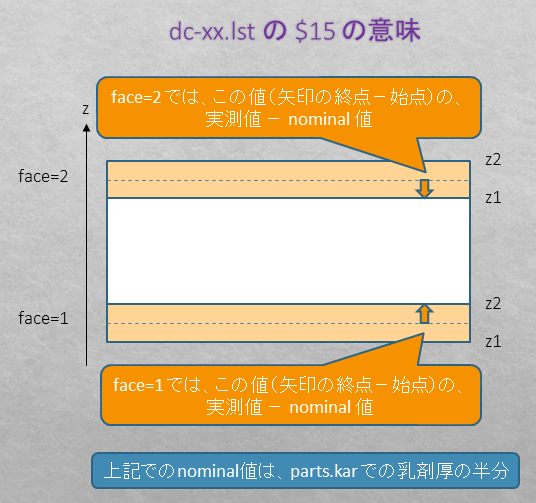

---
#### 補正マップファイル
---
> 下記の３種類の補正マップファイルが存在する。

---
#### 相対補正マップ correction-map-relative  
---  
  > ２つの pos 間の相対的な ( pos0 を基準とした ) 補正マップ。  
  > 各行（区画）には pos1 を pos0 の座標系に変換するための補正値が書いてある。  
  > 最も使用頻度の高い補正マップファイル。  

+ format

  ```
  column  description
  01      区画-id
  02-03   pos0,pos1   pos0( base pos ),pos1   
  04-07   xmin,xmax,ymin,ymax
  08-13   a,b,c,d,p,q => afp ( affine parameter for position )
  14-19   a,b,c,d,p,q => aft ( affine parameter for angle )
  20      dz
  21-23   signal,background,S/N
  24-25   rms_x,rms_y
  26-27   not used
  28-29   rms_ax,rms_ay
  30      not used
  31-32   ix,iy   two dimensional index of the view
  33-38   flags-int
  39-41   flags-double
  ```

+ 補正値の適用法
  > 変換対象の track に最も近い中心座標を持つ区画を選び、補正値を適用する。  
  > 各区画の領域情報(xmin,xmax,ymin,ymax)は pos0 の座標系なので、これを pos1 の座標系に変換する。この変換にはその区画の afp を逆方向に適用する。  
  > NETSCAN 内部では (xmin,ymin) (xmax,ymax) を pos1 の座標系に変換し、これらを対角線上の２頂点とする矩形領域を pos1 座標系での領域と近似している。  
  > 補正の適用方向は順方向、つまり、位置xyに対しては afp を、角度に対しては aft をそのまま適用し、z は z+dz とする。

---
#### distortion-shrink 補正専用 correction-map-for-distortion-shrink-correction
---  
  > プレートの両面乳剤層それぞれの distortion-shrink 補正マップ。各区画は２行で１組である。  
 
+ format

  ```
  column  description
  01      区画-id
  02-03   pos,pos same pos appears twice to have the same format as of the relative correction map
  04-07   xmin,xmax,ymin,ymax
  08-13   not used and always 1,0,0,1,0,0
  14-19   shr,ddz,0,shr,dax,day
  20      dz ( face-1 is always 0 )  
  21-23   signal,background,S/N
  24-25   rms_x,rms_y
  26-27   not used
  28-29   rms_ax,rms_ay
  30      not used
  31-32   ix,iy   two dimensional index of the view
  33-38   flags-int    ca ( compton align ) uses these fileds  
  39-41   flags-double dc uses these fields as below ( implemented from r1162 ) 
            v[0] : shrink-peak-flat-top-width  
            v[1] : distortion-x-peak-flat-top-width  
            v[2] : distortion-y-peak-flat-top-width  
  ```

+ 補正値の適用法
  > 変換対象の track に最も近い中心座標を持つ区画を選び、補正値を順方向に適用する。  
  > 各 face の micro-track への適用ルールは下記の通り。  
  >> ax<sub>corrected</sub> = shr &times; ax<sub>raw</sub> + dax  
  >> ay<sub>corrected</sub> = shr &times; ay<sub>raw</sub> + day  
  >> x<sub>corrected</sub> = x<sub>raw</sub> - ( dz<sub>fulcrum</sub> + ddz ) &times; dax  
  >> y<sub>corrected</sub> = y<sub>raw</sub> - ( dz<sub>fulcrum</sub> + ddz ) &times; day  
  >> z<sub>corrected</sub> = z<sub>raw</sub> + dz  
  >>  
  >>> dz<sub>fulcrum</sub> は下図矢印の nominal 値 ( 終点―始点 )  
  >>> z<sub>fulcrum</sub> ( 下図矢印の終点 ) は parts.kar で未指定の場合ベース表面になっている。  
  >>> explicit に指定もできるが、当面は使用しない事。  
  >>   
  >>   

---
#### 絶対補正マップ correction-map-absolute
---
  > pos の各区画に対する補正値のマップ。  
  > 相対的な補正値ではないため ( correction-map-relative とは違い ) 区画情報も pos での座標系である。  
  > ユーザーから見ると mkmp_p3 での m-file への変換などごく一部で使われているだけだが、  
  > NETSCAN 内部では correction-map-relative をこれに変換して使っている。  

+ format

  ```
  column  description
  01      区画-id
  02-03   pos,pos same pos appears twice to have the same format as of the relative correction map
  04-07   xmin,xmax,ymin,ymax
  08-13   a,b,c,d,p,q => afp ( affine parameter for position )
  14-19   a,b,c,d,p,q => aft ( affine parameter for angle )
  20      dz
  21-23   signal,background,S/N
  24-25   rms_x,rms_y
  26-27   not used
  28-29   rms_ax,rms_ay
  30      not used
  31-32   ix,iy   two dimensional index of the view
  33-38   flags-int    ca ( compton align ) uses these fileds  
  39-41   flags-double  
  ```

+ 補正値の適用法
  > 変換対象の track に最も近い中心座標を持つ区画を選び、補正値を順方向に適用する。  
  > つまり、位置xyに対しては afp を、角度に対しては aft をそのまま適用し、z は z+dz とする。  

