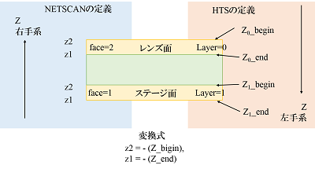

---
#### geometry descriptor files
---

+ face definition
> face ( 1,2 ... ) for HTS scanned data is defined a la SUTS as shown below.  
> 

+ parts.kar ( m:/prg/netscan/ver-2011-03-01/rc/parts.kar )  
  ```
  #
  # opera file                    <- コメント行
  #
  OPERAFilm                       <- chamber.kar で使う parts 名
  290.0 2                         <- (*1)
  1  22.5                         <- (*2)
  2 267.5
  3                               <- component 数
  OPERAEmulsion B      0.0  45.0  <- component #1 [ 物質名 ] [ ID ] [ z0 ] [ z1 ] [[ radiation length ]]
  OPERABase     Base  45.0 245.0  <- component #2
  OPERAEmulsion A    245.0 290.0  <- component #3
  4                               <- point 数
  LD         0.0    0.0           <- point #1 [ ID ] [ x ] [ y ]
  RD    100000.0    0.0           <- point #2
  LDXray  4500.0 5000.0           <- point #3
  RDXray 95500.0 5000.0           <- point #4
  #
  # opera lead
  #
  OPERAPb
  1000.0 0
  1
  OPERAPb Pb 0.0 1000.0
  0
  
  (*1) new version ( version = 2 ) -> [ thickness ] [ number of faces ( max 9 ) ]
       old version ( version = 1 ) -> [ thickness ] [ index of face-1 ] [ index of face-2 ]

  (*2) [ face id (1-9) ] [ parts 座標系での Z ] [[ 不動面の Z ]]
      
      (*) 不動面 = distortion - shrink 補正を行う際にトラック位置を固定する面
          未指定の場合はベース面に設定される。( version = 1 の場合も同様 )
        
      index  : version = 1 では component 境界の index で face を指定する
```

+ chamber.kar ( m:/prg/netscan/ver-2011-03-01/rc/chamber-0.kar )  
  ```
  CHAMBER OPERA_ECC_EXPOSE B999 -1 0.0        <- (*3)
  01   01 OPERAFilm -1 0.000000 0.000000 1.000000 0.000000 <- (*4)
  Pb01 -1 OPERAPb   -1 0.000000 0.000000 1.000000 0.000000
  02   02 OPERAFilm -1 0.000000 0.000000 1.000000 0.000000
  Pb02 -1 OPERAPb   -1 0.000000 0.000000 1.000000 0.000000
  ...
  56   56 OPERAFilm -1 0.000000 0.000000 1.000000 0.000000
  Pb56 -1 OPERAPb   -1 0.000000 0.000000 1.000000 0.000000
  57   57 OPERAFilm -1 0.000000 0.000000 1.000000 0.000000
  ENDCHAMBER
  
  (*3) CHAMBER chamber-type-name chamber-id $1 $2
       $1 : chamber-z-directon スタック順（上から下が正）と chamber 座標系 Z 軸の向き ... 1:同じ -1:逆
       $2 : chamber-z-offset chamber 座標系での z offset
  (*4) $1 : unique-name ( a name of the tape, this plate is sticked onto ? ... set this name to own-name )  
       $2 : own-name like '01', which is unique in chamber.kar  
       $3 : parts-name in parts.kar
       $4 : object coordinate's z-direction is the same (+1) or opposite (-1) to that of stack coordinate. 
       $5,$6 : (x,y) of object-coordinate's origin (0,0) in chamber/stack coordinate. 
       $7,$8 : direction vector of object coordinate's x-axis in chamber/stack corrdinate. 
  ```
  > ```[chamber-z-direction]x[$4-of-each-parts] == 1 is required, because of limited implementation in the code.```  

+ coordinate systems
  - object : defined in parts.kar  
  - stack : chamber.kar の 1st object の z_object=0 が z_stack=0 であり、記載順に大きくなる。 xy は $5-$8 で規定されるが NETSCAN では未実装。
  - chamber :  z_chamber = z_stack x chamber-z-direction + chamber-z-offset / xy_chamber = xy_stack
