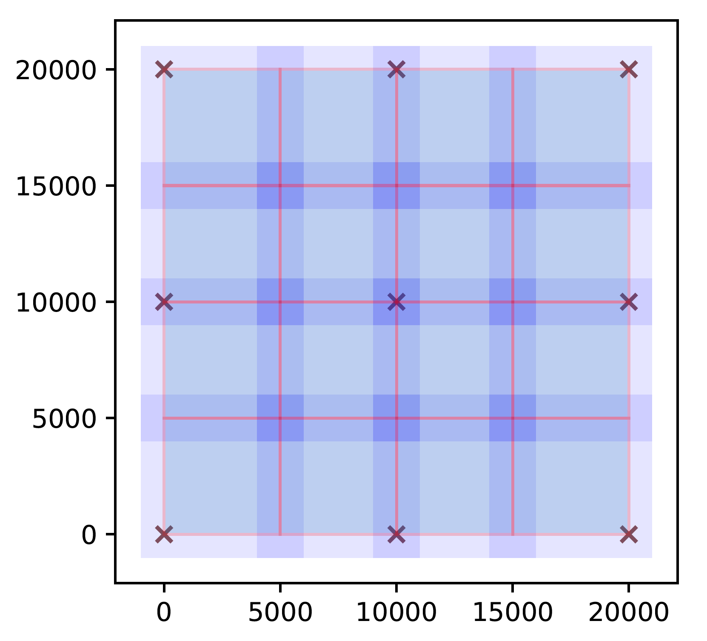

---
#### 処理区画リスト
---

#### description
  > NETSCAN ツールで使う処理区画リストのファイル書式。[mk_views](mk_views.md) で作成できる。  
  > 処理区画サイズ等を各ツール個別に指定する従来の手法ではなく、こちらを使っての処理を推奨する。  
  >

#### file format
  ```
  column  description
  01      id
  02      ix x-index 0 ...  
  03      iy y-index 0 ...  
  04-07   xmin, xmax, ymin, ymax  
          This defines an area on the second pos and is normally an outer area of the view,  
          which is overlapped with neigbouring views.  
  08-11   xmin_i, xmax_i, ymin_i, ymax_i  
          This defines an area on the first pos and is normally an inner area of the view,  
          which is NOT overlapped with neigbouring views.  
  12      fname_rc runcard file name ( use '-' not to specify runcard file )  
  ```
  > column 04-07 で定義される領域 ( outer-zone ) は xmin &le; x &lt; xmax, ymin &le; y &lt; ymax であり、xy ともに下限を含み上限は含まない。  
  > 形状は 1 辺 view-step+view-overlap&times;2 の正方形で、隣接する区画とは view-overlap だけ重複する。 
  >
  > column 08-11 で定義される領域 ( inner-zone ) は xmin_i &le; x &lt; xmax_i, ymin_i &le; y &lt; ymax_i であり、xy ともに下限を含み上限は含まない。  
  > 形状は 1 辺 view-step の正方形で、隣接する区画との重複は無い。 
  >  
  > 最外周の区画は、区画割の余りを含むため、一般的には、上記よりも広くなる [mk_views](mk_views.md) 参照。  
  >
  > inner-zone と outer-zone の使い方は、ツールによって下記の様に異なる。  
  > - [dc](dc.md) : outer-zone だけを使う。(要修正かも)  
  > - [m2b](m2b.md), [t2l](t2l.md) : pos1 ( 1 番目 ) の読み出しには inner-zone を、
  >   pos2 ( 2 番目 ) の読み出しには outer-zone を使う。  
  >   これにより、区画間の ghost を作らずに track の接続ができる。  
  > - [ali-g](ali-g.md), [ali-l](ali-l.md) : pos1 の読み出しには inner-zone を、pos2 の読み出しには outer-zone を、位置ズレの探索範囲分だけ広げて、使う。  
  >
  > なお、処理区画リストの座標は、読み出す track の xy に対するカットになるので、  
  > micro-track であれば乳剤層中央での、base-track であれば face=1 乳剤層ベース表面での、座標として解釈される ([track位置のz面](m2b.md#track-位置の-z-面)) 。  
  >
 
#### FAQ
- **Q** 角度空間を tan&theta;&lt;1 まで計算させるときの、outer-zone サイズは、innter-zone から、どの程度広げるべきか?  
  **A** pos1 で読み出した tan&theta;&le;1 の track の相方の全部を、pos2 で読み出せる様に広げるべき。  
  &emsp; m2b の場合は、ベース厚＋片面乳剤層の厚みが、  
  &emsp; t2l の場合は base-track 間距離 ( プレート間距離＋プレート1枚の厚み ) が、広げるべき最小値になる。  
  &emsp; この値は、[mk_views](mk_views.md) の --view オプションで指定する view-overlap そのものである。

#### Sample
1面と2面それぞれに9本の飛跡がある場合を考える。
```
#   x     y
    0     0
    0 10000
    0 20000
10000     0
10000 10000
10000 20000
20000     0
20000 10000
20000 20000
```
mk_views.exe で `--view 5000 1000` の引数でview listを作ると、以下のようになる。

```
    0     0     0    -1000.0     6000.0    -1000.0     6000.0        0.0     5000.0        0.0     5000.0 -
    1     1     0     4000.0    11000.0    -1000.0     6000.0     5000.0    10000.0        0.0     5000.0 -
    2     2     0     9000.0    16000.0    -1000.0     6000.0    10000.0    15000.0        0.0     5000.0 -
    3     3     0    14000.0    21000.0    -1000.0     6000.0    15000.0    20000.0        0.0     5000.0 -
    4     0     1    -1000.0     6000.0     4000.0    11000.0        0.0     5000.0     5000.0    10000.0 -
    5     1     1     4000.0    11000.0     4000.0    11000.0     5000.0    10000.0     5000.0    10000.0 -
    6     2     1     9000.0    16000.0     4000.0    11000.0    10000.0    15000.0     5000.0    10000.0 -
    7     3     1    14000.0    21000.0     4000.0    11000.0    15000.0    20000.0     5000.0    10000.0 -
    8     0     2    -1000.0     6000.0     9000.0    16000.0        0.0     5000.0    10000.0    15000.0 -
    9     1     2     4000.0    11000.0     9000.0    16000.0     5000.0    10000.0    10000.0    15000.0 -
   10     2     2     9000.0    16000.0     9000.0    16000.0    10000.0    15000.0    10000.0    15000.0 -
   11     3     2    14000.0    21000.0     9000.0    16000.0    15000.0    20000.0    10000.0    15000.0 -
   12     0     3    -1000.0     6000.0    14000.0    21000.0        0.0     5000.0    15000.0    20000.0 -
   13     1     3     4000.0    11000.0    14000.0    21000.0     5000.0    10000.0    15000.0    20000.0 -
   14     2     3     9000.0    16000.0    14000.0    21000.0    10000.0    15000.0    15000.0    20000.0 -
   15     3     3    14000.0    21000.0    14000.0    21000.0    15000.0    20000.0    15000.0    20000.0 -
```

飛跡の位置は×、1面の区画は赤い四角でオーバーラップ無し、2面の区画=探索先は青い四角でオーバーラップ有りとなる。

